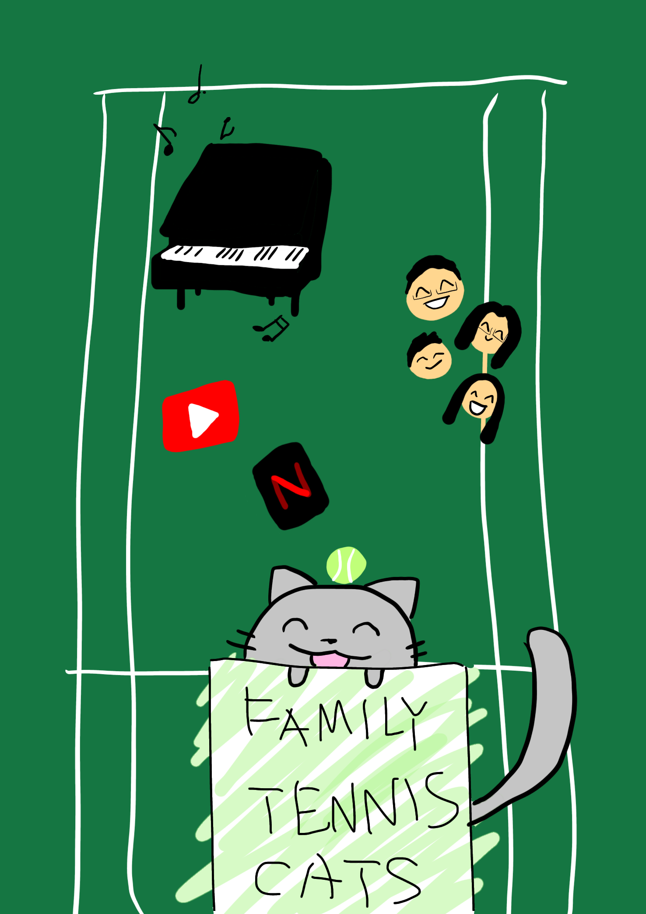

## Welcome to Lilian's Home Page!    

    
    
## Weekly Updates

|Weeks|Struggles|Learned|Tangibles|
|---|---|---|---|---|
| Week 1  |Understanding what the programs+basic commands are/what they do (ex. Vscode, Github, Jupyter Notebooks),Certain commands had to be adjusted to work bc different version (ex. pip -> pip3)| How to solve problems by looking for solutions on the web, learned the basic commands in terminal|   |   |
| Week 2  |   |   |   |   |
| Week 3  |   |   |   |   |

## My Weekend Activities

- Play tennis in the late afternoon
- Practice piano for 1 hour minimum
- Study
- Hang out at a friend's house
- Bake a scrumptious dessert  
<a href="https://www.youtube.com/watch?v=TdbySzheQbE">Click for Strawberry shortcake tutorial :D</a>  
